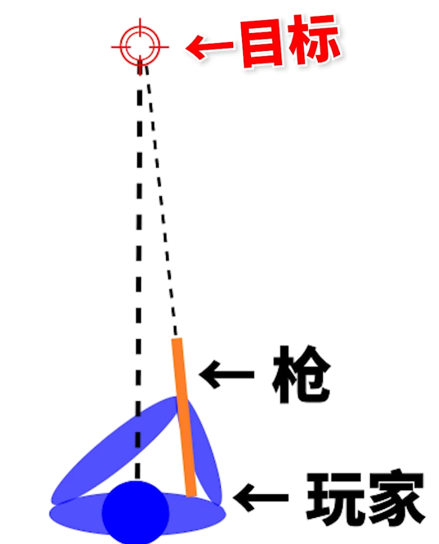
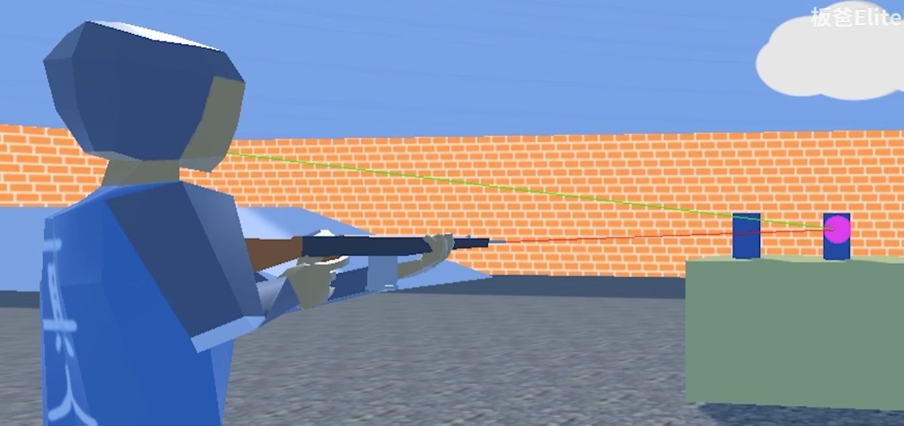

# 双摄像机解决穿模

我们场景中一共有两台摄像机

 

一台用于渲染场景

 

一台用于渲染我们的枪械

 

这样做的好处是：当我们的枪插入墙体的时候，本地玩家看到是正常的。

# 关于射击准星和子弹位置问题

由于我们瞄准的地方是使用我们人物的眼睛，而子弹发生的地方是枪口

用这个方法以假乱真。

 

如果使用枪口射出真子弹可能会有不公平的问题

## 参考文献

[游戏里子弹到底是从哪里射出来的_哔哩哔哩bilibili_使命召唤](https://www.bilibili.com/video/BV1rY411Z7jQ/?spm_id_from=333.337.search-card.all.click&vd_source=ff929fb8407b30d15d4d258e14043130)

​	